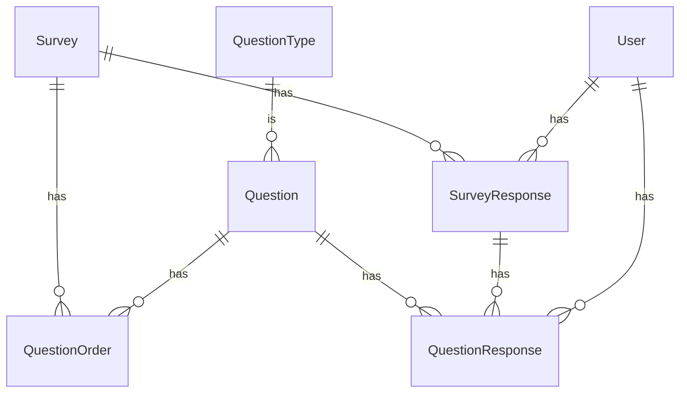

```mermaid
erDiagram
    Survey ||--o{ QuestionOrder : has
    Survey ||--o{ SurveyResponse : has
    QuestionType ||--o{ Question : is
    Question ||--o{ QuestionOrder : has
    Question ||--o{ QuestionResponse : has 
    SurveyResponse ||--o{ QuestionResponse : has
    User ||--o{ QuestionResponse : has
    User ||--o{ SurveyResponse : has
   
```

